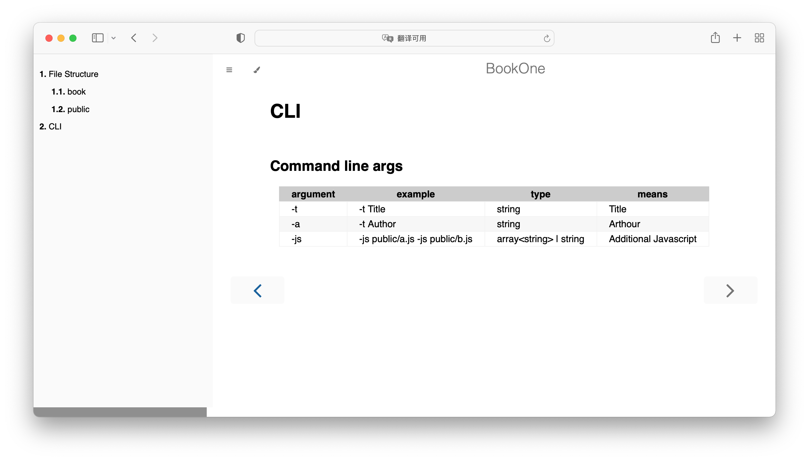
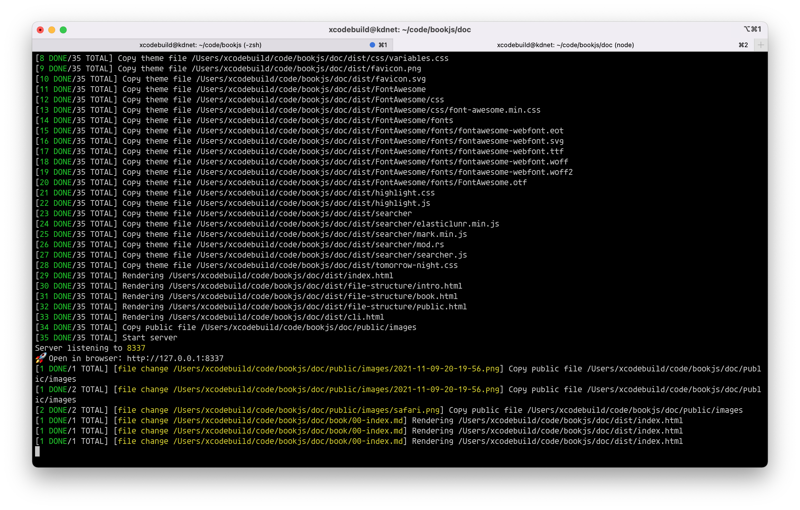

# bookone
[](https://github.com/xcodebuild/bookone/actions/workflows/publish.yml)
[](https://codecov.io/gh/xcodebuild/bookone)
[](https://xcodebuild.github.io/bookone/index.html)                    
Zero configuration book genereator with Markdown.
# Github

[https://github.com/xcodebuild/bookone](https://github.com/xcodebuild/bookone)

## Usage
```
# install bookone
npm install -g bookone

# init a book
mkdir -p newbook/book
cd newbook
echo '# Intro Title\n I am content' > book/00-index.md
echo '# Chapter 1\n I am content of chapter 1' > book/01-chapter-one.md

# start a server and watch change
bookone start -t NewBook

# build only
bookone build -t NewBook

# build with PDF
bookone build -p
# open dist/book.pdf to open book
```

# Example PDF

Build PDF file from this document for example: [Example PDF File](https://xcodebuild.github.io/bookone/book.pdf).
# Related
- default theme from [mdBook](https://github.com/rust-lang/mdBook).

# Screenshot



